# New York City Yellow Taxi Exploratory Data Analysis Report
**Submission done By:** Shivanshu Kumar Singh

- [New York City Yellow Taxi Exploratory Data Analysis Report](#new-york-city-yellow-taxi-exploratory-data-analysis-report)
  - [1 Objective](#1-objective)
  - [2 Problem Statement](#2-problem-statement)
  - [3 Data Understanding](#3-data-understanding)
    - [3.1 Data Description](#31-data-description)
      - [3.1.1 Trip Records](#311-trip-records)
      - [3.1.2 Taxi Zones](#312-taxi-zones)
  - [4 Data Preparation](#4-data-preparation)
    - [4.1 Data Sampling](#41-data-sampling)
    - [4.2 Data Cleaning](#42-data-cleaning)
  - [5 Exploratory Data Analysis](#5-exploratory-data-analysis)
    - [5.1 Temporal Analysis](#51-temporal-analysis)
      - [5.1.1 Analyse the distribution of taxi pickups by hours, days of the week, and months.](#511-analyse-the-distribution-of-taxi-pickups-by-hours-days-of-the-week-and-months)
    - [5.2 Financial Analysis](#52-financial-analysis)
      - [5.2.1 Analyse the revenue distribution trend](#521-analyse-the-revenue-distribution-trend)
      - [5.2.2 Relationship of Fare Amount with Trip Distance, Trip Duration and Number of Passengers](#522-relationship-of-fare-amount-with-trip-distance-trip-duration-and-number-of-passengers)
    - [5.3 Geographical Analysis](#53-geographical-analysis)
      - [5.3.1 Total Trips/Zone vs Zone-wise Number of Trips](#531-total-tripszone-vs-zone-wise-number-of-trips)
    - [5.4 Operational Efficiency Analysis](#54-operational-efficiency-analysis)
      - [5.4.1 Traffic Trend Analysis](#541-traffic-trend-analysis)
      - [5.4.2 Pricing Strategy Analysis](#542-pricing-strategy-analysis)
      - [5.4.3 Customer Experience Analysis](#543-customer-experience-analysis)
      - [5.4.4 Variation of Passenger Count Analysis](#544-variation-of-passenger-count-analysis)
      - [5.4.5 Surcharges Analysis](#545-surcharges-analysis)
  - [6 Conclusion](#6-conclusion)
    - [6.1 Final Insights and Recommendations](#61-final-insights-and-recommendations)
      - [6.1.1 Recommendations to optimize routing and dispatching based on demand patterns and operational inefficiencies](#611-recommendations-to-optimize-routing-and-dispatching-based-on-demand-patterns-and-operational-inefficiencies)
      - [6.1.2 Suggestions on strategically positioning cabs across different zones to make best use of insights uncovered by analysing trip trends across time, days and months.](#612-suggestions-on-strategically-positioning-cabs-across-different-zones-to-make-best-use-of-insights-uncovered-by-analysing-trip-trends-across-time-days-and-months)
      - [6.1.3 Propose data-driven adjustments to the pricing strategy to maximize revenue while maintaining competitive rates with other vendors.](#613-propose-data-driven-adjustments-to-the-pricing-strategy-to-maximize-revenue-while-maintaining-competitive-rates-with-other-vendors)

## 1 Objective
In the case study learned exploratory data analysis (EDA) with the help of a dataset on yellow taxi rides in New York City. It enabled us to understand why EDA is an important step in the process of data science and machine learning.

## 2 Problem Statement
As an analyst at an upcoming taxi operation in NYC, you are tasked to use the 2023 taxi trip data to uncover insights that could help optimise taxi operations. The goal is to analyse patterns in the data that can inform strategic decisions to improve service efficiency, maximise revenue, and enhance passenger experience.

## 3 Data Understanding
- The yellow taxi trip records include fields capturing pick-up and drop-off dates/times, pick-up and drop-off locations, trip distances, itemized fares, rate types, payment types, and driver-reported passenger counts.
- The data is stored in Parquet format (*.parquet*). The dataset is from 2009 to 2024. However, for this assignment, we will only be using the data from 2023.
- The data for each month is present in a different parquet file. We got twelve files for each of the months in 2023.
- The data was collected and provided to the NYC Taxi and Limousine Commission (TLC) by technology providers like vendors and taxi hailing apps.
- You can find the link to the TLC trip records page here: https://www.nyc.gov/site/tlc/about/tlc-trip-record-data.page

### 3.1 Data Description
You can find the data description here: [Data Dictionary](https://www.nyc.gov/assets/tlc/downloads/pdf/data_dictionary_trip_records_yellow.pdf)

#### 3.1.1 Trip Records
|Field Name       |description |
|:----------------|:-----------|
| VendorID | A code indicating the TPEP provider that provided the record.   1= Creative Mobile Technologies, LLC;   2= VeriFone Inc. |
| tpep_pickup_datetime | The date and time when the meter was engaged.  |
| tpep_dropoff_datetime | The date and time when the meter was disengaged.   |
| Passenger_count | The number of passengers in the vehicle.   This is a driver-entered value. |
| Trip_distance | The elapsed trip distance in miles reported by the taximeter. |
| PULocationID | TLC Taxi Zone in which the taximeter was engaged |
| DOLocationID | TLC Taxi Zone in which the taximeter was disengaged |
|RateCodeID |The final rate code in effect at the end of the trip.  1 = Standard rate   2 = JFK   3 = Newark  4 = Nassau or Westchester  5 = Negotiated fare  6 = Group ride |
|Store_and_fwd_flag |This flag indicates whether the trip record was held in vehicle memory before sending to the vendor, aka “store and forward,” because the vehicle did not have a connection to the server.   Y= store and forward trip  N= not a store and forward trip |
|Payment_type| A numeric code signifying how the passenger paid for the trip.   1 = Credit card  2 = Cash  3 = No charge  4 = Dispute  5 = Unknown  6 = Voided trip |
|Fare_amount| The time-and-distance fare calculated by the meter.  Extra Miscellaneous extras and surcharges.  Currently, this only includes the 0.50 and 1 USD rush hour and overnight charges. |
|MTA_tax |0.50 USD MTA tax that is automatically triggered based on the metered rate in use. |
|Improvement_surcharge | 0.30 USD improvement surcharge assessed trips at the flag drop. The improvement surcharge began being levied in 2015. |
|Tip_amount |Tip amount – This field is automatically populated for credit card tips. Cash tips are not included. |
| Tolls_amount | Total amount of all tolls paid in trip.  |
| total_amount | The total amount charged to passengers. Does not include cash tips. |
|Congestion_Surcharge |Total amount collected in trip for NYS congestion surcharge. |
| Airport_fee | 1.25 USD for pick up only at LaGuardia and John F. Kennedy Airports|

Although the amounts of extra charges and taxes applied are specified in the data dictionary, you will see that some cases have different values of these charges in the actual data.

#### 3.1.2 Taxi Zones
- Each of the trip records contains a field corresponding to the location of the pickup or drop-off of the trip, populated by numbers ranging from 1-263.
- These numbers correspond to taxi zones, which may be downloaded as a table or map/shapefile and matched to the trip records using a join.
- This is covered in more detail in later sections.

## 4 Data Preparation
This is the first step of data analysis in which we performed sampling, cleaning, formatting and organizing data for further analysis.

### 4.1 Data Sampling
To ensure a representative subset of trip records for analysis while maintaining uniform coverage across different time periods, a **stratified random sampling** approach was employed. The sampling process was carried out as follows:

1. **Data Source and Structure**  
   - The dataset consists of monthly parquet files named in the format **`YYYY-MM.parquet`**.
   - Each file contains trip records with a **pickup timestamp (`tpep_pickup_datetime`)**, which was used to extract the **date and hour** of each trip.

2. **Sampling Strategy**  
   The data was sampled in a structured manner to ensure uniform distribution across time. The process included:
   
   - **Extracting Unique Dates**:  
     Each monthly dataset was processed to extract all unique dates present in that month.  
   
   - **Iterating Over Each Date**:  
     For every unique date, the dataset was filtered to retrieve all trip records corresponding to that specific day.  

   - **Hourly Segmentation**:  
     Each day was further divided into **24 hourly segments (0 to 23 hours)**. The dataset was filtered to include only the records belonging to each specific hour.  

   - **Random Sampling Per Hour**:  
     Within each hour, **5% of the available records were randomly selected** using a **randomized selection method (`sample(frac=0.05, random_state=42)`)** to ensure consistency and reproducibility of results.  

3. **Data Aggregation**  
   - The hourly sampled data was combined to create a **sampled dataset for the entire month**.
   - Once all monthly files were processed, the sampled data from each month was merged to form a **final dataset covering the entire year**.

4. **Assumptions and Considerations**  
   - It was assumed that all parquet files are stored in a single directory for processing.
   - The **random state (42)** was used to ensure the sampling process is reproducible.
   - Any new columns derived during this process were labeled with a **`_derived` suffix** to differentiate them from the original dataset attributes.

### 4.2 Data Cleaning
To ensure data integrity and improve the quality of analysis, a comprehensive data cleaning process was performed on the sampled dataset.

1. **Dropping Columns** 
    Below unnecessary columns were dropped:
    - `store_and_fwd_flag`: Not useful for analysis; indicates if the trip record was held in vehicle memory before sending to the server.
    - `mta_tax`: Fixed tax amount, does not provide variability.
    - `tolls_amount`: Not relevant for most trips, as tolls are not always applicable.

2. **Datatype Correction** 
    Below columns has incorrect data type and it was fixed as below:
    - `RatecodeID`: It is parsed as float64 but as per the data dictionary the values could be 1, 2, 3, 4, 5, 6 and should be changed to integer.
    - `passenger_count`: It is parsed as float64 but passenger cannot be in decimal so it should be chnaged to int64.
    - `pickup_date_derived`: It is parsed as object but pickup date should be chnaged to date.

3. **Columns Merging** 
    There are two airport fee columns `airport_fee` and `Airport_fee`. This is possibly an error in naming columns. These two columns were merged by adding the values of both columns and the new column was named as `airport_fee_combined`.

4. **Fixing Negative Values** 
    During the data cleaning process, it was observed that certain financial columns contained negative values, which were not expected in the dataset. Specifically, the below columns had negative entries that could have resulted from data entry errors or system inconsistencies.
    - `improvement_surcharge`
    - `total_amount`
    - `congestion_surcharge`
    - `airport_fee_combined`

    To address this issue, the **absolute value function (`abs`)** was applied to these columns, ensuring all values remained positive while preserving their original magnitude. This correction helped maintain data integrity and ensured consistency in financial calculations and analysis.

5. **Fixing Missing Values** 
    To ensure data completeness, missing values in critical columns were identified and addressed. The below columns contained missing entries, which could impact downstream analysis.
    - `passenger_count`
    - `RatecodeID`
    - `congestion_surcharge`
    
    To handle these missing values effectively, the **median function** was applied to each column. The median was chosen as it is less sensitive to extreme values and provides a robust estimate of central tendency. By filling in the missing values with the median, the dataset was improved for reliability while minimizing distortions in the overall distribution.

6. **Handling Outliers** 
    To improve data quality and ensure meaningful analysis, outliers were identified and removed based on domain knowledge and logical constraints. The following steps were taken:  
    - `passenger_count`: Entries where the passenger count exceeded **6** or was **0** were removed to maintain realistic trip records.  
    - `payment_type`: Rows where `payment_type` was **0** were filtered out, as these entries were deemed invalid as per data dictionary.  
    - `tpep_pickup_datetime`, `tpep_dropoff_datetime`: Only records from **2023** were retained, ensuring consistency in the analysis period.  
    - `trip_distance`: Trips shorter than **0.62 miles** or longer than **120 miles** were removed to exclude unrealistic or erroneous trip records.  

    These outlier-handling measures helped refine the dataset, making it more representative of real-world scenarios.

## 5 Exploratory Data Analysis
Analysing and visualizing data to understand its main features, find patterns, and discover how different parts of the data are connected.

### 5.1 Temporal Analysis

#### 5.1.1 Analyse the distribution of taxi pickups by hours, days of the week, and months.
| Chart 1              | Chart 2               | Chart 3               |
| ---------------------- | ---------------------- | ---------------------- |
| 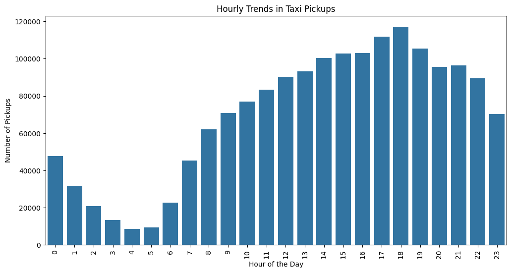 | 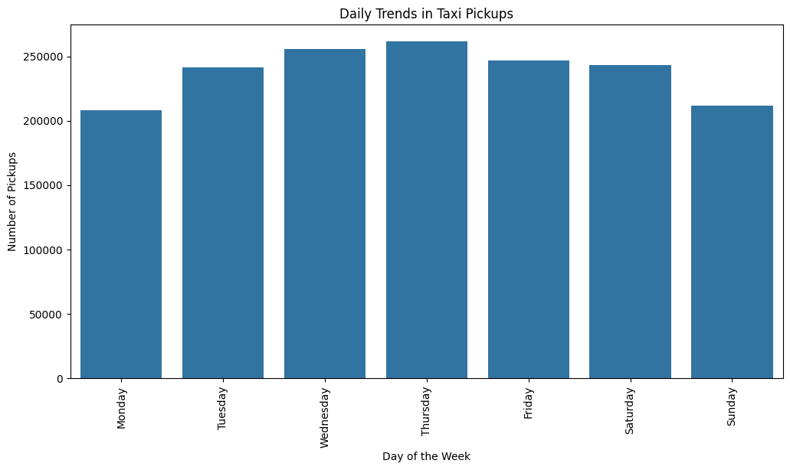 | 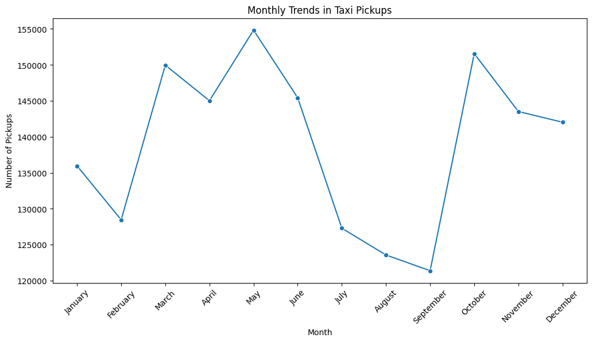 |

The charts reveal several key insights. The highest number of trips in May occurred on `Thursdays`. A clear pattern emerges, with taxi rides peaking in the morning, stabilizing around noon, and rising again in the evening. The busiest period is `between 5:00 PM and 7:00 PM`.

### 5.2 Financial Analysis

#### 5.2.1 Analyse the revenue distribution trend
| Chart 1              | Chart 2               | Chart 3               |
| ---------------------- | ---------------------- | ---------------------- |
| 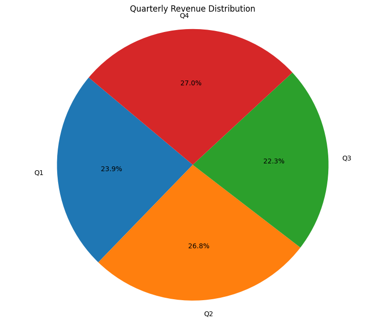 | 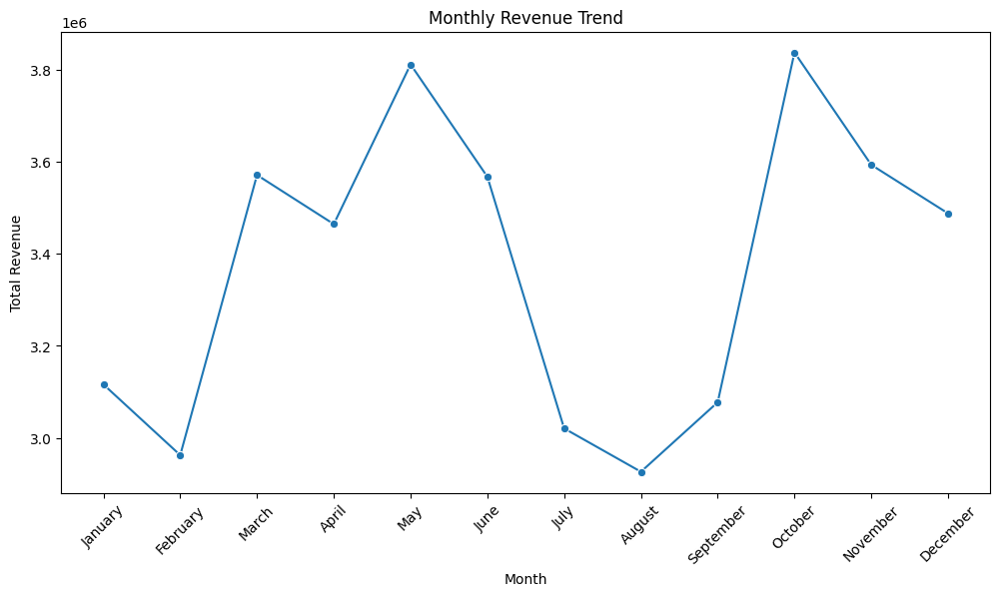 | 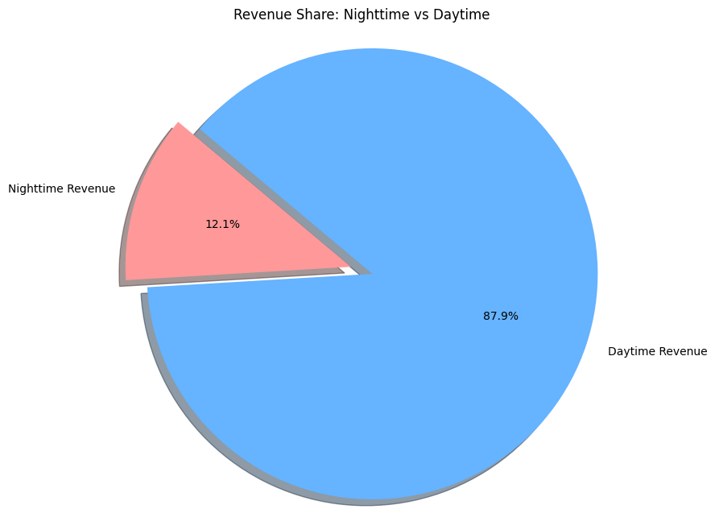 |

The key insights from the above charts are that the highest revenue was generated in Quarter 4, with October being the peak month. Conversely, the lowest revenue occurred in Quarter 3, with August being the bottom month. Most of the revenue was generated by the trips completed in daytime.

#### 5.2.2 Relationship of Fare Amount with Trip Distance, Trip Duration and Number of Passengers
| Chart 1              | Chart 2               |
| ---------------------- | ---------------------- |
| 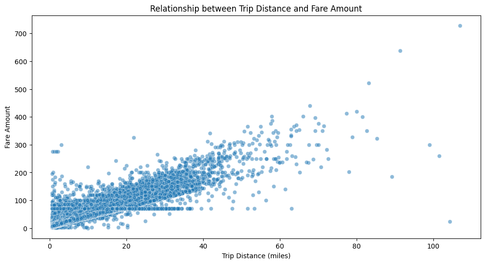 |  |

1. **Relationship between Trip Distance and Fare Amount** 
    - There seems to be a positive correlation between trip distance and fare amount. As the trip distance increases, the fare amount generally increases as well.
    - The data points are spread out, indicating variability in fare amounts for similar trip distances. This could be due to factors like traffic, time of day, or additional charges.
    - The majority of the data points are clustered in the lower range of trip distances (0-20 miles) and fare amounts (0-200 dollars), suggesting that most trips are relatively short and inexpensive.

2. **Relationship between Trip Duration and Fare Amount** 
    - There seems to be a positive correlation between trip duration and fare amount. As the trip duration increases, the fare amount also tends to increase. This is expected since longer trips typically cost more.
    - The data points are spread out, indicating variability in fare amounts for similar trip durations. This could be due to different rates, traffic conditions, or other variables affecting the fare.
    - Most of the data points are clustered in the lower range of trip durations (0-400 minutes) and fare amounts (0-200). This suggests that the majority of trips are relatively short and inexpensive.

| Chart 3              | Chart 4               |
| ---------------------- | ---------------------- |
| 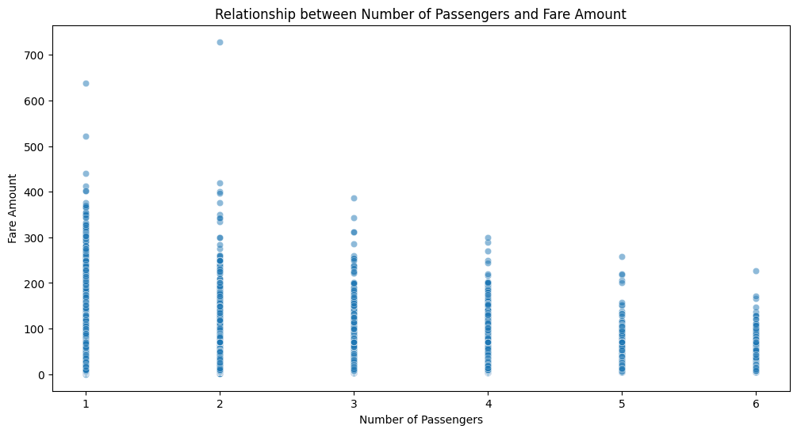 | 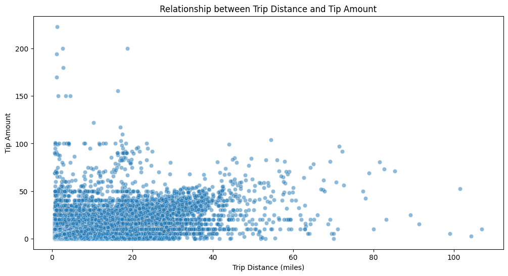 |

1. **Relationship between Number of Passengers and Fare Amount** 
    - The correlation between the number of passengers and the fare amount is weak.
    - We can observe that single passengers tend to travel longer distances compared to groups, as the fare amount is higher for single passengers. This indicates a positive correlation between trip distance and fare amount.

2. **Relationship between Trip Distance and Tip Amount** 
    - There seems to be a positive correlation between trip distance and tip amount. As the trip distance increases, the tip amount also tends to increase.
    - While there is a general upward trend, there is significant variability in tip amounts for similar trip distances. This suggests that factors other than distance (such as service quality, passenger generosity, or fare amount) may influence tipping behavior.
    - The majority of the data points are clustered in the lower range of trip distances (0-40 miles) and tip amounts (0-100). This suggests that most trips are relatively short, and tips are modest.
    - The highest tip amounts are observed for trips around 60-80 miles, but these are less frequent.

### 5.3 Geographical Analysis

#### 5.3.1 Total Trips/Zone vs Zone-wise Number of Trips
| Chart 1              | Chart 2               |
| ---------------------- | ---------------------- |
| 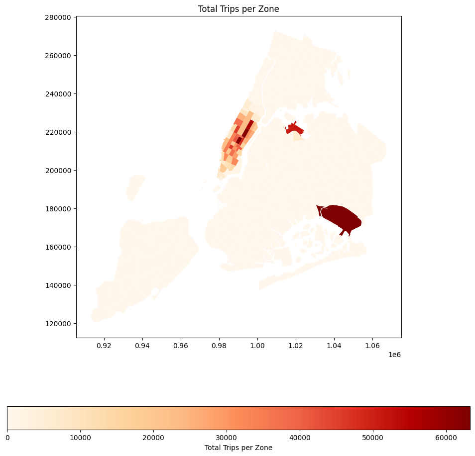 | 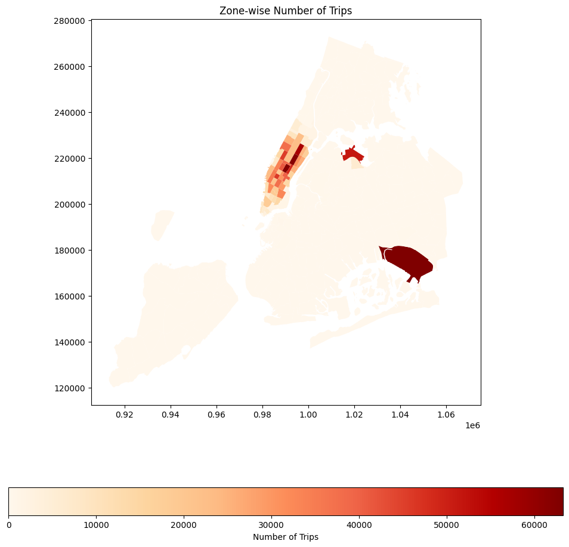 |

- The values from 0.92 to 1.06 suggest that most zones have a relatively similar number of trips, with minor variations. This could indicate a balanced distribution of trips across these zones.
- The value 1e6 (1,000,000) stands out significantly from the other values. This suggests that there is one zone with an exceptionally high number of trips compared to the others. This zone is `Location ID: 132` and `Zone Name: JFK Airport`, it could be a central hub, a major transportation center, or a highly populated area.
- Below are the top 5 zones with highest amount of rides:
    | Location ID | Zone Name | Rides |
    | ----------- | --------- |------ |
    | 131 | JFK Airport | 63323 |
    | 160 | Midtown Center | 62509 |
    | 236 | Upper East Side South | 62075 |
    | 235 | Upper East Side North | 56765 |
    | 137 | LaGuardia Airport | 51537 |
- Below are the top 5 zones with lowest amount of rides:
    | Location ID | Zone Name | Rides |
    | ----------- | --------- |------ |
    | 26 | Breezy Point/Fort Tilden/Riis Beach | 0 |
    | 31 | Bronxdale | 0 |
    | 29 | Broad Channel | 0 |
    | 244 | West Brighton | 0 |
    | 2 | Allerton/Pelham Gardens | 0 |

### 5.4 Operational Efficiency Analysis

#### 5.4.1 Traffic Trend Analysis
| Chart 1              | Chart 2               | Chart 3               |
| ---------------------- | ---------------------- | ---------------------- |
| 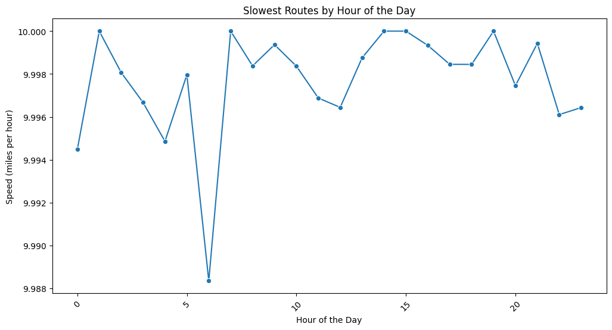 | 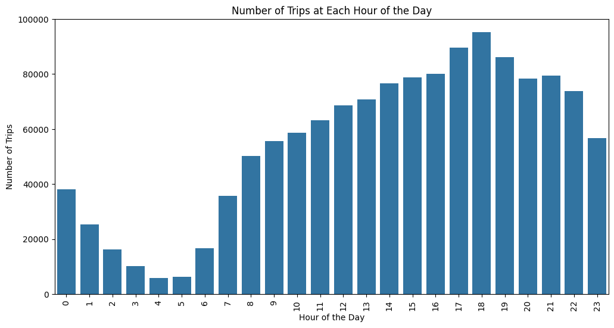 | 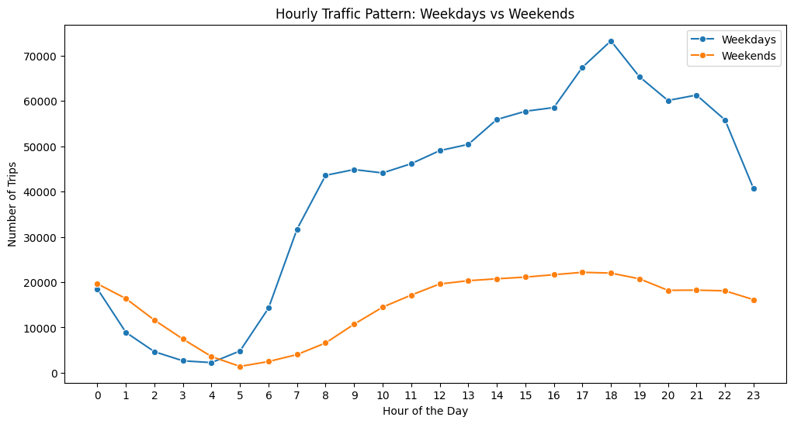 |

From the above charts, insights can help in understanding traffic behavior and planning transportation strategies accordingly.

- The speed remains relatively constant, fluctuating between approximately `9.988` and `10.000` miles per hour.
- The slowest routes do not vary significantly in speed throughout the day, indicating consistent traffic conditions on these routes.
- Peak hours with higher trip volumes are between morning and evening rush hours.
- Weekdays shows higher trip volumes during commuting hours (e.g., 7-9 AM and 4-7 PM), while weekends have more consistent trip volumes throughout the day, peaking in the afternoon.

#### 5.4.2 Pricing Strategy Analysis
| Chart 1              | Chart 2               | Chart 3               |
| ---------------------- | ---------------------- | ---------------------- |
| 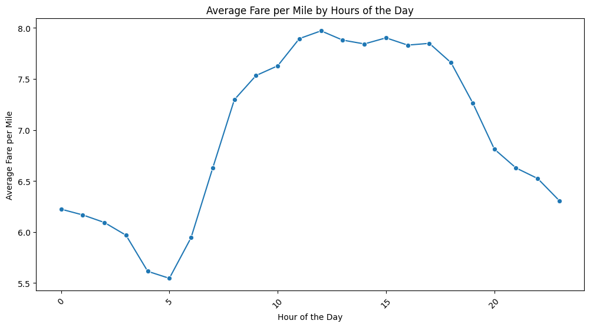 | 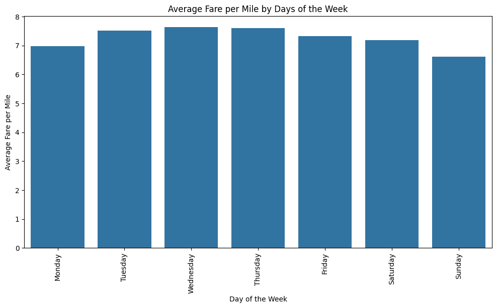 | 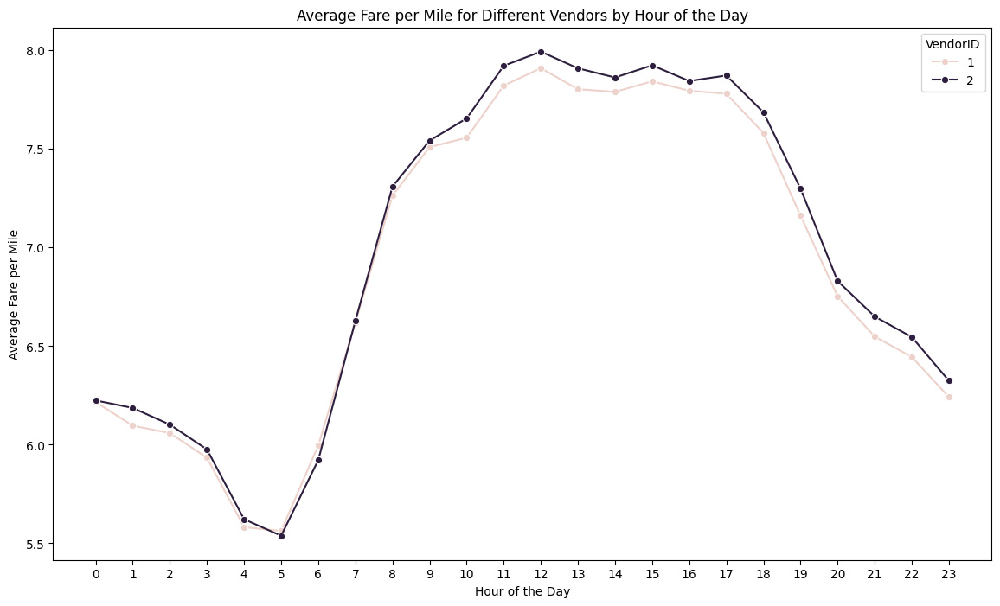 |

The above charts provide insights into the average fare per mile for rides at different hours of the day on different days, with a focus on different vendors.

- The fare per mile is around 5.5 at certain hours, indicating a baseline rate.
- There are peaks and troughs, suggesting that fares are higher during specific times, possibly due to demand surges (e.g., rush hours) or lower during off-peak times.
- Vendor 1 generally has a higher average fare per mile compared to Vendor 2 throughout most hours.
- Both vendors show similar trends with higher fares during certain hours, likely corresponding to peak demand times.
- The fare per mile for both vendors ranges between 5.5 and 7.5, with Vendor 1 consistently at the higher end of this range.

#### 5.4.3 Customer Experience Analysis
| Chart 1              | Chart 2               | Chart 3               |
| ---------------------- | ---------------------- | ---------------------- |
| 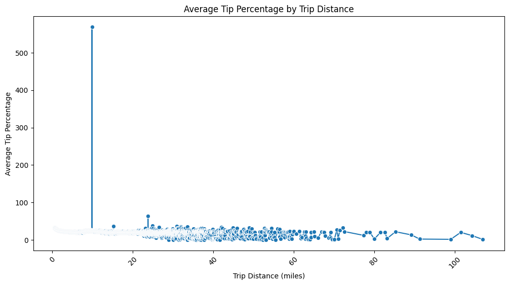 | 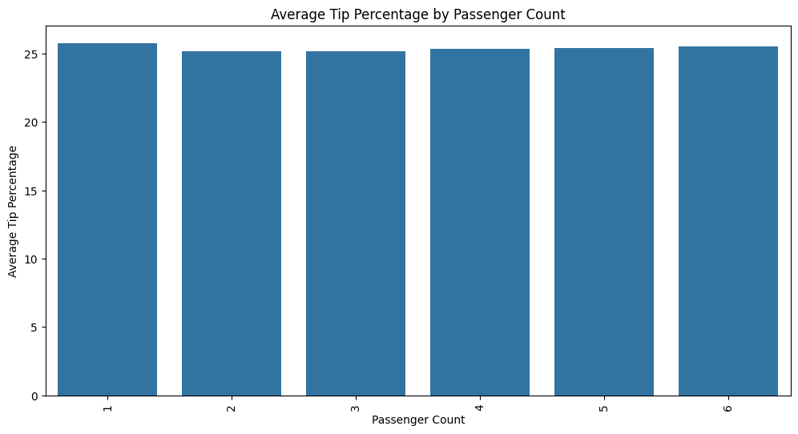 | 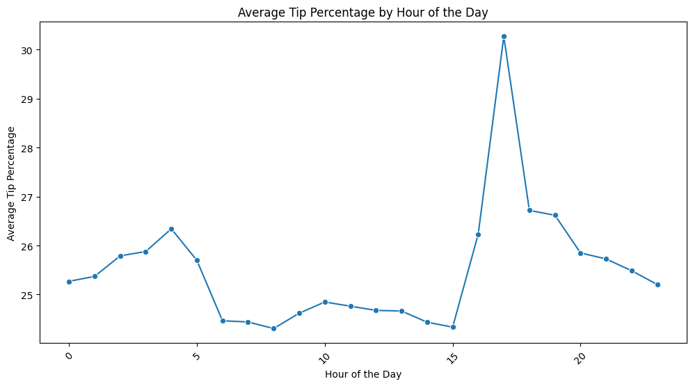 |

The above charts provide insights into how different factors influence the average tip percentage for trips.

- The graph `Chart1` shows that as the trip distance increases, the average tip percentage generally decreases. This could indicate that passengers are less inclined to tip a higher percentage for longer trips, possibly due to the higher total cost of the trip.
- The graph `Chart2` suggests that the number of passengers in a trip affects the average tip percentage. It appears that trips with fewer passengers tend to have a higher tip percentage. This might be because individual passengers are more likely to tip generously when they are alone or in smaller groups.
- The graph `Chart3` indicates that the time of day also influences tipping behavior. The average tip percentage peaks during certain hours, possibly during peak travel times or late-night hours when passengers might be more generous. There is a noticeable variation in tip percentages throughout the day, suggesting that time of day is a significant factor in tipping behavior.

#### 5.4.4 Variation of Passenger Count Analysis
| Chart 1              | Chart 2               |
| ---------------------- | ---------------------- |
| 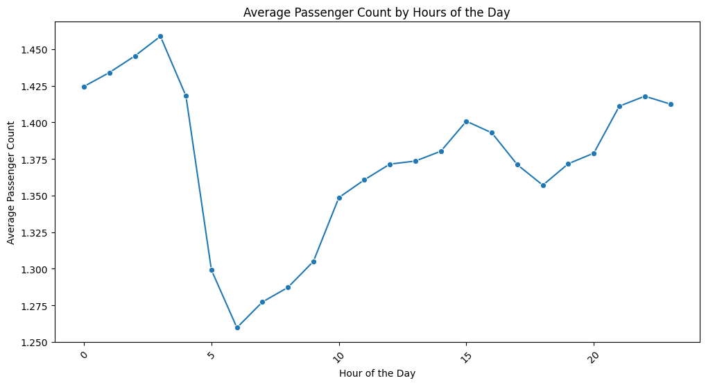 | 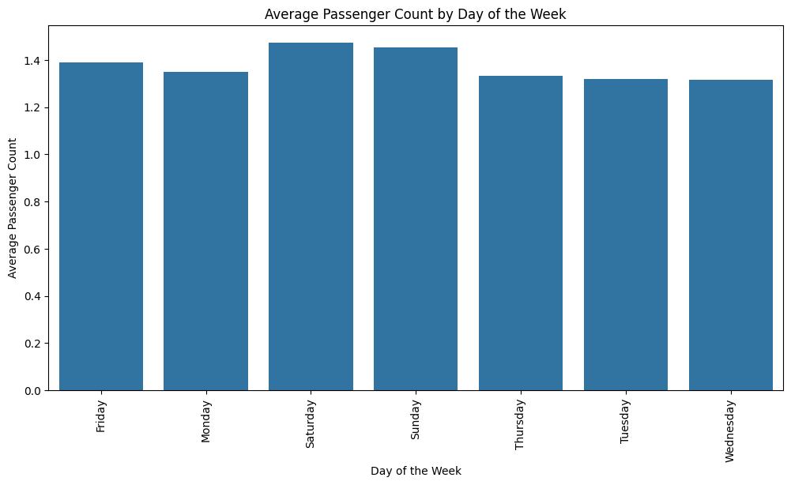 |

The above charts provide insights into average passenger counts based on different time frames and zones.

- The highest average passenger count is around 03:00 AM and the lowest average passenger count is around 06:00 AM.
- The highest average passenger count is on Saturday and the lowest average passenger count is on Monday.

#### 5.4.5 Surcharges Analysis
| Chart 1              |
| ---------------------- |
|  |

- The graph shows the number of surcharges applied during each hour of the day.
- The graph likely shows higher surcharge frequencies during certain hours, possibly corresponding to peak usage times.
- There are likely periods with minimal surcharges, possibly during late-night or early-morning hours when demand is lower.
- List of pickup zones where surcharges are applied more frequently:
    | PULocationID | surcharge_count | LocationID | Zone Name                     |
    |--------------|-----------------|------------|--------------------------|
    | 132          | 63323           | 132.0      | JFK Airport              |
    | 161          | 62509           | 161.0      | Midtown Center           |
    | 237          | 62075           | 237.0      | Upper East Side South    |
    | 236          | 56765           | 236.0      | Upper East Side North    |
    | 138          | 51537           | 138.0      | LaGuardia Airport        |
    | 162          | 48627           | 162.0      | Midtown East             |
    | 186          | 46196           | 186.0      | Penn Station/Madison Sq West |
    | 142          | 45746           | 142.0      | Lincoln Square East      |
    | 230          | 41478           | 230.0      | Times Sq/Theatre District |
    | 170          | 39864           | 170.0      | Murray Hill              |
- List of dropoff zones where surcharges are applied more frequently:
    | DOLocationID | surcharge_count | LocationID | Zone Name                |
    |--------------|-----------------|------------|--------------------------|
    | 236          | 60252           | 236      | Upper East Side North    |
    | 237          | 54974           | 237      | Upper East Side South    |
    | 161          | 49982           | 161      | Midtown Center           |
    | 239          | 39468           | 239      | Upper West Side South    |
    | 170          | 39321           | 170      | Murray Hill              |
    | 142          | 38454           | 142      | Lincoln Square East      |
    | 162          | 37528           | 162      | Midtown East             |
    | 141          | 36021           | 141      | Lenox Hill West          |
    | 230          | 35909           | 230      | Times Sq/Theatre District |
    | 68           | 33990           | 68       | East Chelsea             |

## 6 Conclusion

### 6.1 Final Insights and Recommendations

#### 6.1.1 Recommendations to optimize routing and dispatching based on demand patterns and operational inefficiencies
Based on the analysis of demand patterns and operational inefficiencies, below are some recommendations:
- Allocate more cabs during peak day hours (6 AM to 10 PM) based on the analysis at section 3.2.2.
- Implement surge pricing in high-demand zones during daytime peak periods.
- Adjust pricing according to the time of day and day of the week, based on the analysis of average fare per mile for different hours and days. (Derived from section 3.2.4 and 3.2.10)
- As an outcome for the analysis conducted at section 3.2.7, we should increase number of cabs in high-demand pickup and dropoff zones during night hours (11 PM to 5 AM).
- Repositioning algorithms can be introduced for cabs positioning to fulfill the deman surges in these areas.

#### 6.1.2 Suggestions on strategically positioning cabs across different zones to make best use of insights uncovered by analysing trip trends across time, days and months.
| Chart 1              |
| ---------------------- |
| 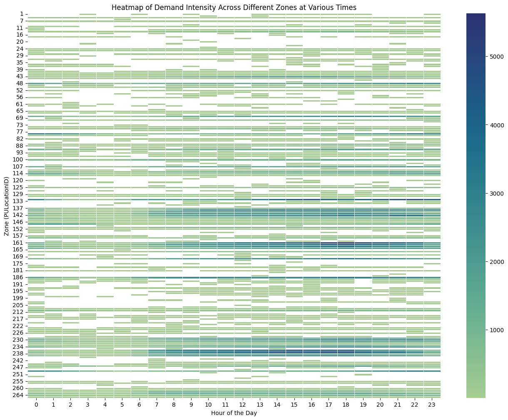 |

Suggestions on strategically positioning cabs based on trip trends:
- From the above heatmap we can identify zones with high demand during peak hours (e.g., rush hour, evenings).
- Position more cabs in these high-demand zones during peak times to reduce wait times and improve customer satisfaction.
- Observe how demand fluctuates throughout the day.
- Adjust cab deployment accordingly, increasing presence during peak periods and reducing it during lulls.
- Deploy more cabs on weekdays during peak hours and adjust deployment for weekend demand patterns, which might be concentrated in specific areas or times. (Derived from 3.2.4)
- Position cabs strategically to efficiently serve short and long-distance trips, optimizing overall efficiency.

#### 6.1.3 Propose data-driven adjustments to the pricing strategy to maximize revenue while maintaining competitive rates with other vendors.
Below are recommendations for data-driven adjustments to the pricing strategy to maximize revenue while maintaining competitive rates with other vendors:
- Monthly revenue is very low in July, August, September company can offer competative price as compared to other vendor during these month which can incrase pickup during that time and also revenue will increase.
- Correlation between Trip Duration and Fare Amount is 0.32 which is very low. Company can impose waiting charge for the ride which will increse the corrreation between these two variables.
- Fare amount depended on count of pessenger can also increase the revenue for the company.
- Consider using machine learning models to predict demand elasticity for various distances. This would allow more precise price adjustments.
